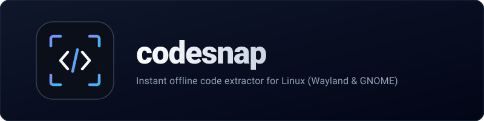
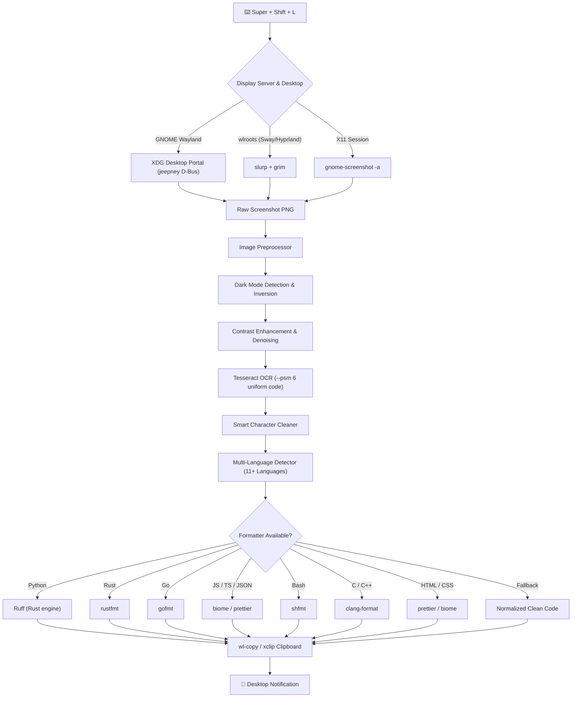

<div align="center">



<br/>
<br/>

**Instant, offline code extractor for Linux (Wayland & GNOME).**

*Turn video tutorials, PDFs, conference talks, and IDE screenshots into clean, formatted code on your clipboard in milliseconds.*

<br/>

[](https://github.com/aswin402/codesnap/actions/workflows/ci.yml)
[](https://pypi.org/project/codesnap-cli/)
[](https://github.com/aswin402/codesnap/releases/latest)
[](https://opensource.org/licenses/MIT)
[](https://www.python.org/)
[](https://gitlab.freedesktop.org/wayland)
[](https://github.com/astral-sh/ruff)

<br/>

<table>
<tr>
<td align="center">
<b>Hotkey Trigger</b><br/>
<code>Super + Shift + L</code>
</td>
<td align="center">
<b>Selection</b><br/>
Native Desktop Portal Crosshair
</td>
<td align="center">
<b>Processing</b><br/>
Denoise + Invert + PSM 6 OCR
</td>
<td align="center">
<b>Formatting</b><br/>
Blazing-fast Ruff (Rust)
</td>
<td align="center">
<b>Result</b><br/>
Clean Code in Clipboard
</td>
</tr>
</table>

</div>

---

## 🌟 Why codesnap?

Standard OCR tools stumble on code: dark themes fail contrast checks, indentation gets mangled, language keywords are misread, and Wayland compositors (like GNOME Mutter) block legacy capture utilities.

`codesnap` is purpose-built for developers:

| Feature | Standard OCR Utilities | codesnap v2.4 |
|---|---|---|
| **Wayland Support** | ❌ Fails on Mutter / GNOME 40+ | ✅ Native XDG Desktop Portal + `slurp` fallback |
| **Dark Theme IDEs** | ❌ Poor contrast, missing symbols | ✅ Automatic polarity detection & contrast inversion |
| **OCR Code Cleaning** | ❌ Leaves stray `\|`, broken `def` | ✅ AST-safe token correction (preserves `100`, `utf8`) |
| **Indentation & Formatting**| ❌ Random tabs, mangled blocks | ✅ Multi-language auto-formatting (Ruff, rustfmt, gofmt, biome, prettier) |
| **Resource Footprint** | ⚠️ Heavy wheels (`numpy`), 100MB+ | ✅ Zero NumPy bloat — C-accelerated Pillow, <400ms runtime |
| **Language Intelligence** | ❌ Plain unformatted text | ✅ 11+ languages auto-detected & highlighted |
| **Privacy & Security** | ⚠️ Often calls cloud APIs | ✅ 100% offline and local — zero network requests |

---

## 🚀 Quick Start
 
### Option A: One-Liner Install (Recommended)

Run this single command in your terminal. It installs system tools, configures the environment with `uv`, and registers <kbd>Super</kbd> + <kbd>Shift</kbd> + <kbd>L</kbd>:

```bash
curl -sSL https://raw.githubusercontent.com/aswin402/codesnap/main/setup.sh | bash
```

### Option B: Install via PyPI (`pip` / `uv`)

Install globally as a CLI tool:

```bash
# Using uv (fastest & recommended)
uv tool install codesnap-cli

# Run instantly without installing
uvx codesnap-cli

# Or using standard pip
pip install codesnap-cli
```

### Option C: Install from Source

```bash
git clone https://github.com/aswin402/codesnap.git
cd codesnap
chmod +x setup.sh
./setup.sh
```

Verify your installation:
```bash
codesnap --version
```

### 2. Upgrading Existing Installations

If you already have `codesnap` installed, upgrade in-place without touching system packages:

```bash
git pull
./localupdate.sh
```

---

## 🎯 Usage

### Keyboard Workflow
1. Press <kbd>Super</kbd> + <kbd>Shift</kbd> + <kbd>L</kbd> anywhere on your system.
2. Select any code block on your screen (press <kbd>Esc</kbd> anytime to cancel).
3. `codesnap` extracts, cleans, normalizes, and auto-formats the code.
4. A desktop notification confirms: `Python • 14 lines copied`.
5. Paste directly into your editor with <kbd>Ctrl</kbd> + <kbd>V</kbd>.

### CLI & Power-User Options

```bash
# Extract code directly from an existing image file
codesnap /path/to/screenshot.png

# Save extracted code straight to a file
codesnap /path/to/screenshot.png -o snippet.py

# Pipe extracted code directly to stdout
codesnap /path/to/screenshot.png -c | bat -l python

# Override language auto-detection
codesnap /path/to/screenshot.png -l rust

# High-quality preprocessing for low-res or blurry screenshots
codesnap --high-quality

# Review and edit OCR output in $EDITOR before copying to clipboard
codesnap --interactive

# Inspect diagnostics and system backend health
codesnap --version
```

---

## 🧠 System Architecture



### Supported Formatters

| Language | Primary Formatter | Fallback Formatter | Offline / Auto-fallback |
|---|---|---|:---:|
| **Python** | `ruff` (bundled in venv) | — | ✅ Guaranteed |
| **Rust** | `rustfmt` | — | ✅ Graceful passthrough |
| **Go** | `gofmt` | — | ✅ Graceful passthrough |
| **JavaScript / TypeScript / JSON** | `biome` | `prettier` | ✅ Graceful passthrough |
| **Bash / Shell** | `shfmt` | — | ✅ Graceful passthrough |
| **C / C++** | `clang-format` | — | ✅ Graceful passthrough |
| **HTML / CSS** | `prettier` | `biome` | ✅ Graceful passthrough |

---

## 💻 Desktop Compatibility Matrix

| Environment | Display Protocol | Capture Backend | Status |
|---|---|---|:---:|
| **Ubuntu 24.04 / 26.04 (GNOME 46+)** | Wayland | XDG Desktop Portal (`jeepney`) | 🟢 **Native** |
| **Sway / Hyprland** | Wayland | `slurp` + `grim` | 🟢 **Supported** |
| **Ubuntu / Debian (GNOME / XFCE)** | X11 | `gnome-screenshot` / `xclip` | 🟢 **Supported** |
| **KDE Plasma** | Wayland / X11 | Portal / `spectacle` | 🟡 **Compatible** |

---

## 🛠️ Project Structure

```
codesnap/
├── pyproject.toml        # Modern build metadata & dependency manifest (hatchling)
├── codesnap.py           # Compatibility proxy CLI entrypoint
├── setup.sh              # First-time installation & hotkey registration script
├── localupdate.sh        # Fast in-place upgrade script for existing installs
├── src/codesnap/
│   ├── __init__.py       # Package metadata & version
│   ├── cli.py            # CLI entrypoint & pipeline orchestration
│   ├── capture.py        # Wayland XDG Desktop Portal & slurp capture engine
│   ├── image.py          # Dark theme polarity detection & image enhancement
│   ├── ocr.py            # Tesseract OCR engine with uniform code tuning
│   ├── cleaner.py        # Token-safe character normalization
│   ├── languages.py      # Heuristic language pattern detection
│   ├── formatters.py     # Rust-based Ruff code formatter integration
│   ├── clipboard.py      # wl-copy / xclip & desktop notification handlers
│   └── exceptions.py     # Typed domain exceptions
└── tests/                # 37 automated unit tests
    ├── test_capture.py
    ├── test_cleaner.py
    ├── test_cli.py
    ├── test_formatters.py
    ├── test_image.py
    ├── test_languages.py
    └── test_ocr.py
```

---

## 🧪 Development & Quality Assurance

All features and bug fixes are accompanied by automated tests:

```bash
# Run unit test suite (37 tests)
uv run pytest

# Check code formatting & style with Ruff
uv run ruff check .
uv run ruff format --check .

# Auto-format codebase
uv run ruff format .
```

---

## 📜 Changelog

Detailed release notes and migration guides are documented in [CHANGELOG.md](file:///home/aswin/programming/vscode/myProjects/codesnap/CHANGELOG.md).

---

## 🗑️ Uninstall

```bash
rm -rf ~/.local/share/codesnap
rm ~/.local/bin/codesnap
```

Then remove the custom shortcut in **Settings → Keyboard → Keyboard Shortcuts → Custom Shortcuts**.

---

### vibe coded by Aswin